
МИНИСТЕРСТВО НАУКИ И ВЫСШЕГО ОБРАЗОВАНИЯ
РОССИЙСКОЙ ФЕДЕРАЦИИ
ФЕДЕРАЛЬНОЕ ГОСУДАРСТВЕННОЕ БЮДЖЕТНОЕ
ОБРАЗОВАТЕЛЬНОЕ УЧРЕЖДЕНИЕ ВЫСШЕГО ОБРАЗОВАНИЯ
«САХАЛИНСКИЙ ГОСУДАРСТВЕННЫЙ УНИВЕРСИТЕТ»

 

Институт естественных наук и техносферной безопасности

Кафедра информатики

Пашаян Самвел Алексанович

 

Работа с данными в Python pandas

01.03.02 Прикладная математика и информатика

 

Научный руководитель

Лоскутов Артём Владимирович

Южно-Сахалинск

2023 г.

<b> ЗАДАНИЕ </b>

 <b> JavaScript </b> Найти любой источник данных в интернете, загрузить с помощью pandas, посчитать основные статистики, построить произвольные графики в matplotlib 

 РЕШЕНИЕ ЗАДАНИЯ 

 
 <b> JavaScript </b> В качестве источниках данных для работы я выбрал базу по аниме рейтингу 

<b> Запуск файла Jupyter Notebook (перед этим нужно предварительно установить все модули, которые используются) </b>

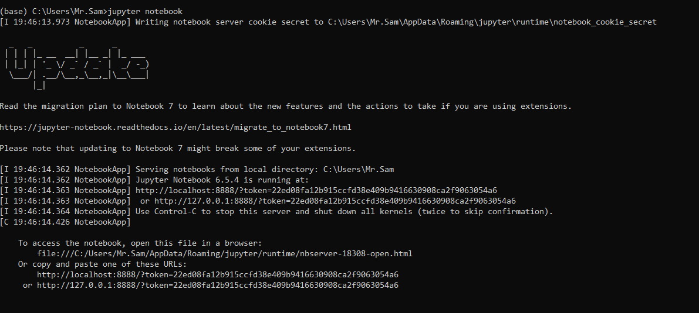

<b>1 шаг</b>

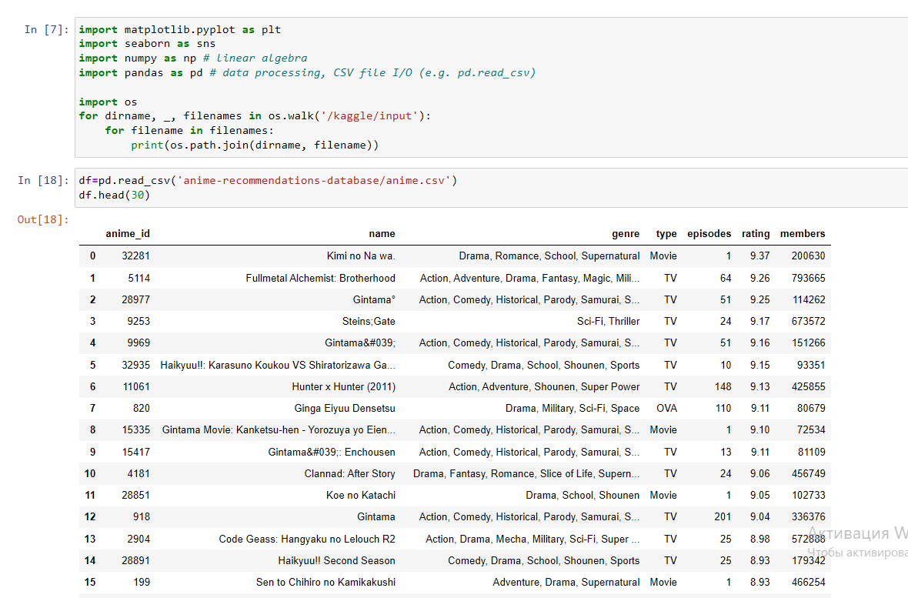

<b>2 шаг</b>

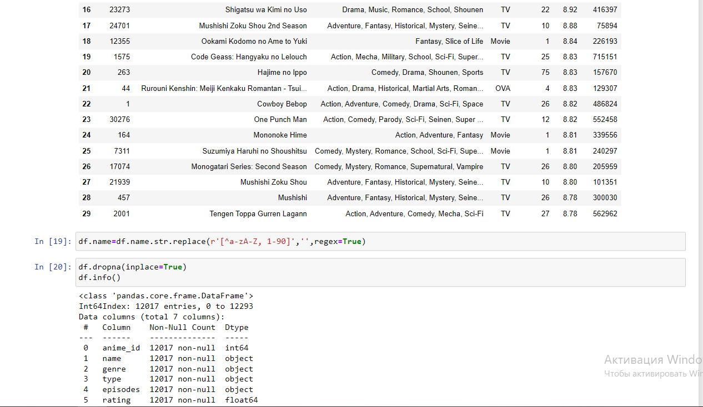

<b>3 шаг</b>

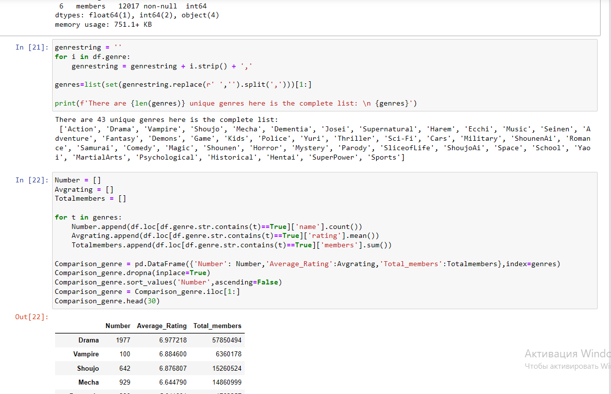

<b>4 шаг</b>

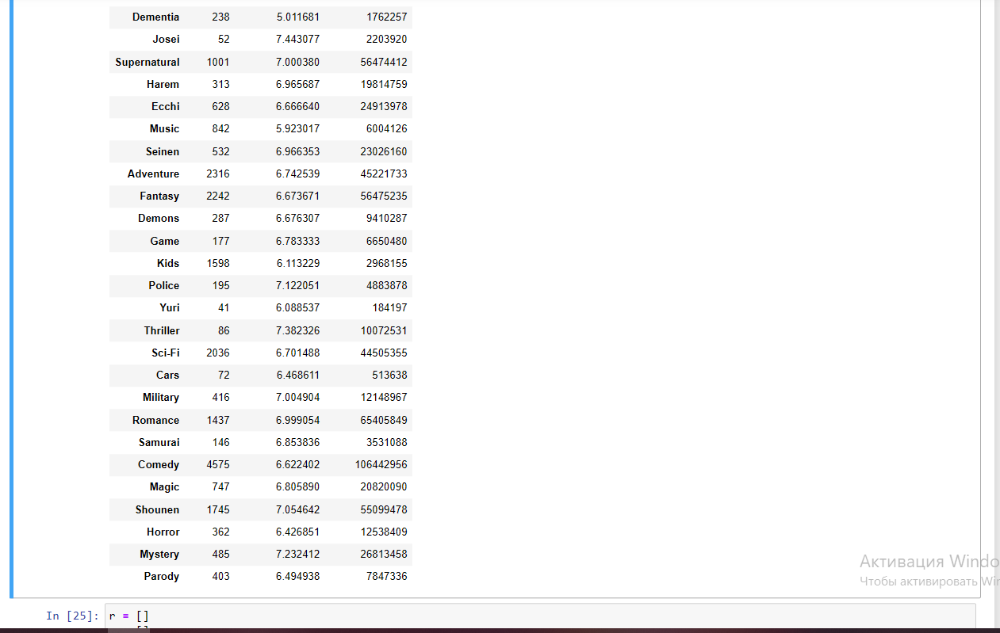

<b>5 шаг</b>

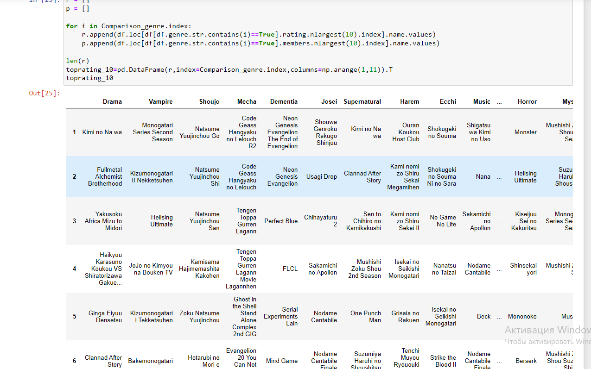

<b>6 шаг</b>

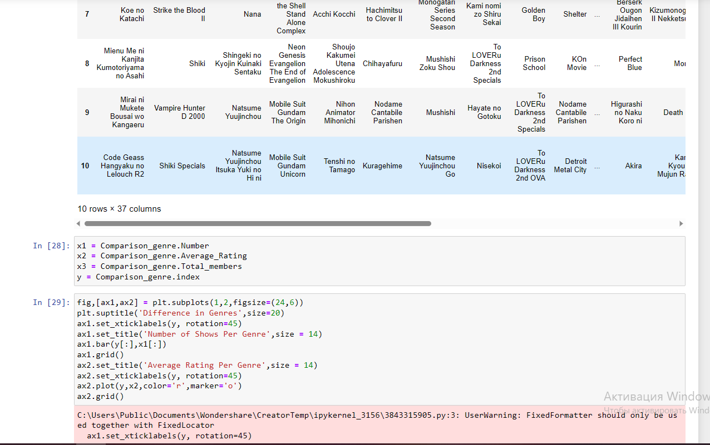

<b>7 шаг</b>

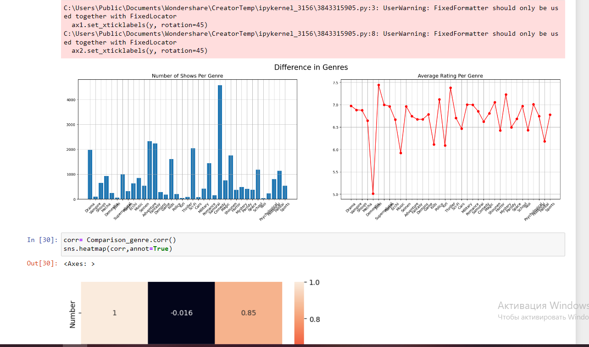

<b>8 шаг</b>

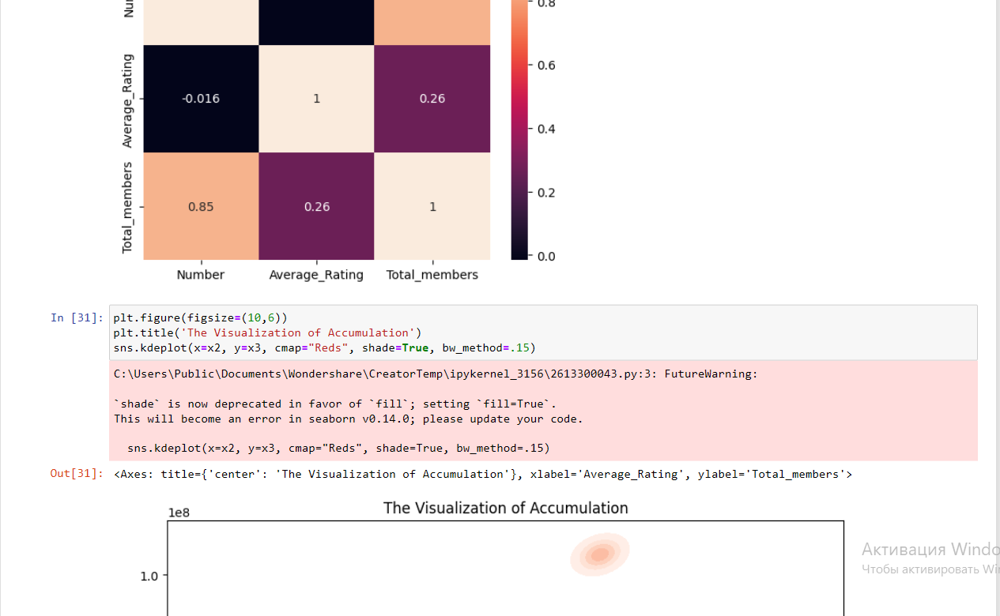

<b>9 шаг</b>

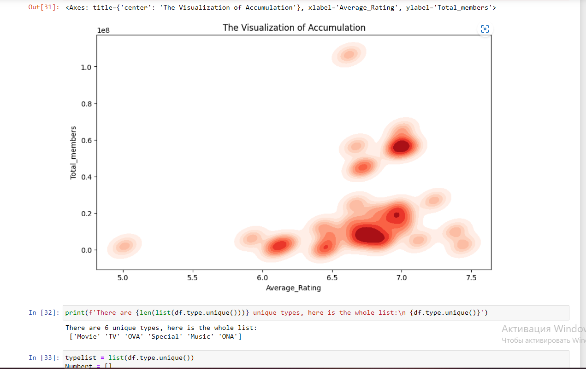

<b>10 шаг</b>

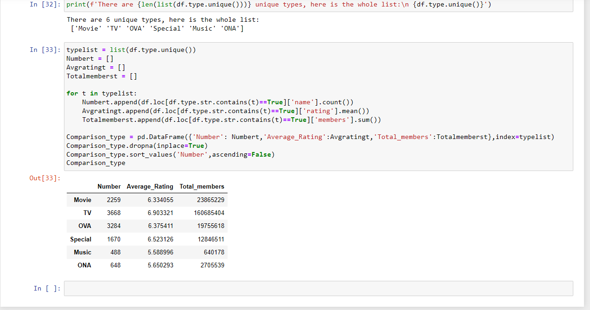